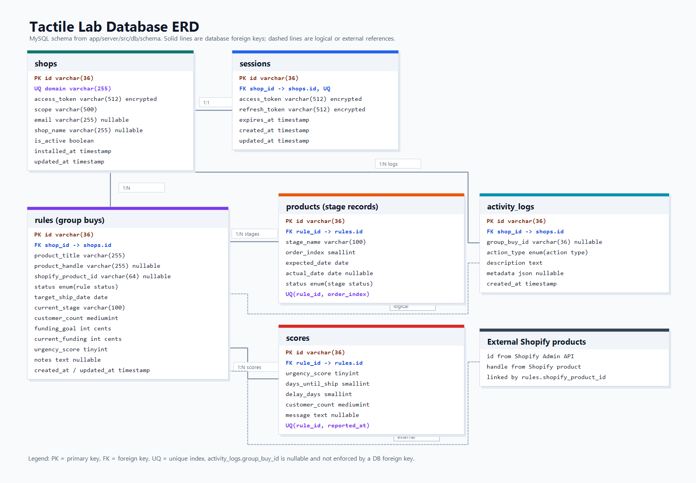

# Tactile Lab - Architecture Guide

This document explains the project in simple words. It is written for a reviewer who wants to understand what was built, where the code lives, and how the parts work together.

## Step 1 - Does This Follow The Take-Home Task?

Yes. The project matches the requested stack and features.

| Requirement | Done? | Where |
| --- | --- | --- |
| Custom Shopify theme | Yes | `theme/` |
| Shopify Liquid, CSS, minimal JavaScript | Yes | `theme/sections`, `theme/assets` |
| Home page | Yes | `theme/templates/index.json` |
| Collection page | Yes | `theme/templates/collection.json`, `theme/sections/main-collection.liquid` |
| Product page | Yes | `theme/templates/product.json`, `theme/sections/main-product.liquid` |
| Cart page | Yes | `theme/templates/cart.json`, `theme/sections/main-cart.liquid` |
| At least 3 custom sections | Yes | Hero Banner, Featured Collection, Product Recommender, Main Product, Main Cart |
| Standout interactive feature | Yes | Build Your Board configurator and product quiz |
| Embedded Shopify Admin app | Yes | `app/client`, `app/server` |
| Vite frontend | Yes | `app/client` |
| Node.js backend | Yes | `app/server` |
| Drizzle ORM | Yes | `app/server/src/db` |
| MySQL database | Yes | Drizzle schema and migration files |
| Shopify OAuth flow | Yes | `app/server/src/modules/auth` |
| Multiple related tables | Yes | shops, sessions, rules, products, scores, activity_logs |
| Dashboard | Yes | `app/client/src/routes/Dashboard.tsx` |
| Create/update workflow | Yes | `RuleEditor.tsx` and `/api/rules` routes |
| History/activity tracking | Yes | `activity_logs` table and Activity page |
| Logic-based feature | Yes | Urgency scoring and ranked dashboard |
| Setup instructions | Yes | `docs/SETUP.md` |
| App decisions document | Yes | `APP_DECISIONS.md` |

## Step 2 - Store Concept

The fictional store is **Tactile Lab**.

It sells premium mechanical keyboards, keycaps, switches, and desk accessories.

The store is built around a real problem in this niche: **group buys**. A group buy is a pre-order campaign where customers pay before the product is manufactured. Merchants need to track funding, production, delays, and shipping.

## Step 3 - App Concept

The embedded Shopify app is called **Group Buy Manager**.

It helps the merchant answer one main question:

```text
Which group buy needs attention first?
```

The app does this by:

- Tracking each group buy.
- Tracking the current production stage.
- Tracking customer count and funding.
- Tracking supplier delays.
- Calculating an urgency score.
- Showing the most urgent group buys first.
- Saving activity history.

## Step 4 - Main Folder Structure

```text
shopify-store-tactile-lab/
  theme/                  Shopify storefront theme
  app/
    client/               Embedded app frontend, built with Vite and React
    server/               Backend API, built with Node.js and Express
  docs/                   Architecture, ERD, and setup guide
  APP_DECISIONS.md        Product and technical decisions
```

More detail:

```text
theme/
  assets/                 CSS and small JavaScript files
  sections/               Shopify custom sections
  snippets/               Reusable Liquid snippets
  templates/              Shopify page templates

app/client/
  src/routes/             Dashboard, Group Buys, Activity, Settings
  src/components/         Shared UI components
  src/lib/apiClient.ts    Central API helper

app/server/
  src/app.ts              Express app setup
  src/router.ts           Main API router
  src/modules/            Feature modules
  src/db/schema/          Drizzle database tables
  src/db/migrations/      MySQL migration files
```

## Step 5 - Shopify Theme Architecture

The theme is in `theme/`.

It uses:

- Shopify Liquid for templates and sections.
- CSS for branding and layout.
- Small JavaScript files for interactions.
- Shopify Ajax Cart endpoints for cart behavior.

Main theme pages:

| Page | Main files | Purpose |
| --- | --- | --- |
| Home | `templates/index.json` | Hero, featured products, and quiz section. |
| Collection | `templates/collection.json`, `sections/main-collection.liquid` | Product listing page. |
| Product | `templates/product.json`, `sections/main-product.liquid` | Product details, variants, configurator. |
| Cart | `templates/cart.json`, `sections/main-cart.liquid` | Cart review and checkout link. |

Custom sections:

| Section | File | What it does |
| --- | --- | --- |
| Hero Banner | `sections/hero-banner.liquid` | Branded first screen for the store. |
| Featured Collection | `sections/featured-collection.liquid` | Shows selected products and filters by tag. |
| Product Recommender | `sections/product-recommender.liquid` | Quiz that recommends keyboard products. |
| Main Product | `sections/main-product.liquid` | Product page plus Build Your Board configurator. |
| Main Cart | `sections/main-cart.liquid` | Cart page with quantity controls. |

Standout interactive feature:

```text
Build Your Board Configurator
```

If a product has the `configurator` tag, the product page lets the shopper choose:

1. Base keyboard.
2. Switch type.
3. Keycap style.

The page updates the price and saves the choices as Shopify line item properties when the item is added to cart.

## Step 6 - Embedded App Architecture

The embedded app has two parts:

| Part | Folder | Technology | Purpose |
| --- | --- | --- | --- |
| Frontend | `app/client` | Vite, React, TypeScript | Admin interface inside Shopify. |
| Backend | `app/server` | Node.js, Express, TypeScript | API, OAuth, database logic. |

Frontend routes:

| Route | File | Purpose |
| --- | --- | --- |
| `/` | `Dashboard.tsx` | Shows stats and urgent group buys. |
| `/group-buys` | `GroupBuysList.tsx` | Shows all group buys. |
| `/group-buys/new` | `RuleEditor.tsx` | Creates a group buy. |
| `/group-buys/:id/edit` | `RuleEditor.tsx` | Updates a group buy. |
| `/activity` | `ActivityLog.tsx` | Shows the activity history. |
| `/settings` | `Settings.tsx` | Shows shop and app info. |

Backend modules:

| Module | Folder | Purpose |
| --- | --- | --- |
| Auth | `modules/auth` | Shopify OAuth, JWT cookies, session refresh. |
| Shops | `modules/shops` | Current shop info and uninstall status. |
| Rules | `modules/rules` | Group buy create, read, update, delete. |
| Scoring | `modules/scoring` | Urgency score calculation. |
| Activity | `modules/activity` | Activity log and history. |
| Dashboard | `modules/dashboard` | Dashboard totals and ranked data. |

## Step 7 - How A Request Works

Most API requests follow this path:

```text
React page
  -> apiClient.ts
  -> Express /api route
  -> requireAuth middleware
  -> Controller
  -> Service
  -> Repository
  -> Drizzle ORM
  -> MySQL
```

Simple explanation:

1. The React page asks for data.
2. The API client sends cookies and the shop domain.
3. Express receives the request.
4. Auth middleware checks the user session.
5. The controller reads input and sends output.
6. The service runs business logic.
7. The repository talks to the database.
8. Drizzle builds and runs the SQL query.

## Step 8 - API Routes

Base URL:

```text
/api
```

Important routes:

| Method | Route | Purpose |
| --- | --- | --- |
| GET | `/api/health` | Check that the API is running. |
| GET | `/api/auth/install?shop=...` | Start Shopify OAuth install. |
| GET | `/api/auth/callback` | Handle Shopify OAuth callback. |
| POST | `/api/auth/refresh` | Refresh session cookies. |
| POST | `/api/auth/logout` | Clear session cookies. |
| GET | `/api/dashboard` | Full dashboard data. |
| GET | `/api/dashboard/summary` | Smaller dashboard summary. |
| GET | `/api/rules` | List group buys. |
| GET | `/api/rules/:id` | Get one group buy. |
| POST | `/api/rules` | Create a group buy. |
| PUT | `/api/rules/:id` | Update a group buy. |
| DELETE | `/api/rules/:id` | Delete a group buy. |
| GET | `/api/scoring/ranked` | Rank group buys by urgency. |
| POST | `/api/scoring/:ruleId/score` | Calculate and save a score. |
| GET | `/api/scoring/:ruleId/history` | View score history. |
| GET | `/api/activity` | View activity log. |
| GET | `/api/activity/recent` | View recent activity. |
| GET | `/api/shops/me` | View current shop info. |

## Step 9 - Authentication Flow

The app uses Shopify OAuth.

Flow:

1. Merchant opens `/api/auth/install?shop=STORE.myshopify.com`.
2. Server sends the merchant to Shopify.
3. Merchant approves the app.
4. Shopify sends the merchant back to `/api/auth/callback`.
5. Server checks Shopify's HMAC signature.
6. Server exchanges the code for a Shopify access token.
7. Server saves the shop and session in MySQL.
8. Server sets secure cookies.
9. Merchant is sent back into Shopify Admin.

Cookies used:

| Cookie | Purpose |
| --- | --- |
| `tl_access_token` | Short session token for API calls. |
| `tl_refresh_token` | Longer token used to refresh the session. |
| `tl_shop` | Shop domain used as fallback context. |

The cookies are `httpOnly`, `secure`, and `sameSite=none`. This is important because Shopify embedded apps run inside an iframe.

## Step 10 - Database Design

The database uses MySQL and Drizzle ORM.

Schema files are here:

```text
app/server/src/db/schema/
```

ERD:



Tables:

| Table | Simple meaning |
| --- | --- |
| `shops` | Installed Shopify stores. |
| `sessions` | Login/session data for each shop. |
| `rules` | Group buys. The name is historical, but the data is group buys. |
| `products` | Production stages for each group buy. The name is historical. |
| `scores` | Saved urgency score snapshots. |
| `activity_logs` | History of merchant and system actions. |

Relationships:

| Relationship | Meaning |
| --- | --- |
| One shop has one session | `shops.id -> sessions.shop_id` |
| One shop has many group buys | `shops.id -> rules.shop_id` |
| One group buy has many stages | `rules.id -> products.rule_id` |
| One group buy has many scores | `rules.id -> scores.rule_id` |
| One shop has many activity logs | `shops.id -> activity_logs.shop_id` |
| One activity log may point to a group buy | `activity_logs.group_buy_id` is a logical link |

Important note:

The `products` table does **not** store Shopify storefront products. In this app, it stores manufacturing stages like Funding, Tooling, Assembly, QC, and Shipping.

## Step 11 - Urgency Scoring Logic

The scoring feature is the main product-thinking feature in the app.

It gives each group buy a score from 0 to 100.

The score uses three inputs:

| Input | Weight | Simple meaning |
| --- | ---: | --- |
| Days until ship date | 45% | A close or overdue ship date is more urgent. |
| Delay days | 30% | A delayed supplier or stage is more urgent. |
| Customer count | 25% | More waiting customers means higher risk. |

Score levels:

| Score | Level | Meaning |
| ---: | --- | --- |
| 75 to 100 | Critical | Act now. |
| 50 to 74 | High | Review today. |
| 25 to 49 | Medium | Watch closely. |
| 0 to 24 | Low | On track. |

The dashboard sorts group buys by this score so the merchant can focus on the most urgent work first.

## Step 12 - Activity Tracking

Activity tracking records important events, such as:

- Group buy created.
- Group buy updated.
- Group buy cancelled.
- Stage updated.
- Supplier update added.
- Alert fired.
- Score recalculated.
- Shop installed.
- Shop uninstalled.

This gives the merchant a simple history of what happened and when.

## Step 13 - Build And Verification

The project currently verifies with build checks.

Server:

```powershell
cd app\server
npm run build
```

Client:

```powershell
cd app\client
npm run build
```

There is no active `npm test` script yet. The files in `app/server/test` are empty placeholders.

## Step 14 - What The Reviewer Should Notice

The project is more than basic CRUD because it includes:

- A clear fictional brand.
- A custom storefront theme.
- A creative product configurator.
- A quiz-based recommendation feature.
- A merchant dashboard.
- Group buy urgency scoring.
- Activity history.
- OAuth and secure embedded app flow.
- Related MySQL tables with migrations.
- Clear setup and architecture documentation.
